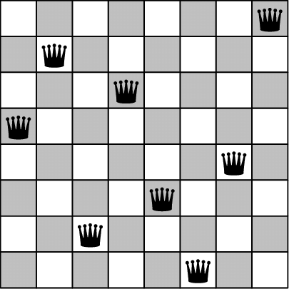

# The Eight Queens Problem

Place eight queens on an 8x8 chess board so they don't threaten each other. How many possibilities are there?

[Wikipedia - SPOILER ALTERT](https://en.wikipedia.org/wiki/Eight_queens_puzzle)

## Step 1

How can you easily detect when queens threaten each other? i.e. how to represent the queens and/or the board so you can determine whether they are placed in the same row, column or diagonal?

## Step 2

How many possibilities are there for an 8x8 board (including symmetric solutions)?

## Bonus 1

Generalize your algorithm to work for any dimension of boards.

## Bonus 2

How long does your algorithm take to calculate the solutions for dimension 12?

